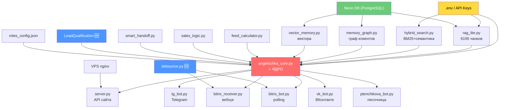

# ⚡ КАРТА ДВУХ АНЖЕЛ — ЕДИНСТВЕННЫЙ ИСТОЧНИК ПРАВДЫ
# Обновлено: 09.06.2026 | ПРАВИЛО — каждая сессия читает это при буте!

---

## 🔴 ГЛАВНОЕ ПРАВИЛО: КТО ЕСТЬ КТО

### Анжела ЗАБОТКИНА — основная, боевая, продакшн
- **Роль:** AI-продавец + CRM-ассистент 24/7
- **Каналы присутствия:**
  - 🌐 **Сайт vezemcip.ru** — чат-виджет (через angela-server API)
  - 📱 **Telegram** — @angelochka_bot (angela-bot, polling)
  - 💼 **Битрикс24 основной** — слушает, читает, учится (angela-listener)
  - 🔵 **ВКонтакте** — чат-бот сообщества «ВезёмЦыплят» (angela-vk-bot)
- **Знания и навыки распространяются на ВСЕ эти каналы!**
- **Ядро:** `angelochka_core.py` — единый мозг для всех каналов
- **AI:** Каскад LLM (MiMo → Kimi → Perplexity → Claude → DeepSeek → auto)
- **CRM:** ОСНОВНОЙ Битрикс (`BITRIX_WEBHOOK_URL`)

### Анжела ПТЕНЧИКОВА — тестовая, песочница
- **Роль:** Тестирование новых возможностей внутри Битрикса + продвижение
- **Каналы присутствия:**
  - 💼 **Битрикс24 ПЕСОЧНИЦА** — и больше НИГДЕ!
- **⛔ НЕТ в Telegram, НЕТ на сайте, НЕТ в ВК!**
- **CRM:** ПЕСОЧНИЦА (`SANDBOX_BITRIX_WEBHOOK_URL`)
- **PM2:** `ptenchikova-bot` — работает автономно, не трогает боевые каналы

---

## АРХИТЕКТУРА НА VPS (72.56.38.19)

```
┌─────────────────────────────────────────────────────────────────┐
│         АНЖЕЛА ЗАБОТКИНА — МУЛЬТИ-КАНАЛЬНЫЙ AI-ПРОДАВЕЦ         │
│                                                                 │
│  PM2 процессы:                                                  │
│    angela-bot (id:5)      → tg_bot.py     → Telegram 24/7      │
│    angela-listener (id:10)→ listener.py   → Битрикс CRM 24/7   │
│    angela-server (id:1)   → server.py     → API сайта + VK order│
│    angela-vk-bot (id:9)   → vk_bot.py     → ВК чат-бот 24/7    │
│                                                                 │
│  Единый мозг: angelochka_core.py                                │
│  Единые знания: RAG Lite (6195 чанков из 18 PDF)                │
│  Единый прайс: 22 позиции (май 2026)                            │
│  Единые роли: Клиент / Босс / Создатель / Сотрудник             │
│                                                                 │
│  ЧТО УМЕЕТ:                                                    │
│  • Продаёт птицу клиентам (сайт, ТГ, ВК)                       │
│  • Знает ВСЕ цены, породы, расписание доставок                 │
│  • Слушает звонки (транскрипции из Битрикса)                   │
│  • RAG-база: 18 PDF (Ross, Cobb, Orvia, вакцинация...)         │
│  • SmartFAQ — автокэш частых вопросов                          │
│  • Phone-First Protocol — допы только после телефона            │
│  • Граф памяти клиентов + векторный поиск                      │
│  • Калькулятор кормов (Purina Starter/Grower/Finisher)          │
│                                                                 │
│  ⛔ НЕ ДЕЛАЕТ:                                                  │
│  • НЕ шлёт отчёты по расписанию (только по запросу)             │
│  • НЕ связана с cron/scheduler                                 │
│  • НЕ рассылает алерты автоматически                           │
└─────────────────────────────────────────────────────────────────┘

┌─────────────────────────────────────────────────────────────────┐
│         АНЖЕЛА ПТЕНЧИКОВА — ТЕСТ + ПРОДВИЖЕНИЕ                  │
│                                                                 │
│  PM2: ptenchikova-bot (id:0) → ptenchikova_bot.py               │
│  CRM: ПЕСОЧНИЦА Битрикс (SANDBOX_BITRIX_WEBHOOK_URL)            │
│                                                                 │
│  ЧТО ДЕЛАЕТ:                                                   │
│  • Тестирует новые фичи Битрикса (до деплоя на боевой)         │
│  • Занимается продвижением                                     │
│  • Работает с задачами проекта в песочнице                      │
│                                                                 │
│  ⛔ НЕ ДЕЛАЕТ:                                                  │
│  • НЕ отвечает клиентам                                        │
│  • НЕ работает в ТГ, на сайте или в ВК                         │
│  • НЕ продаёт птицу                                            │
└─────────────────────────────────────────────────────────────────┘

Другие процессы:
  vezem-web (id:3)          → Astro сайт vezemcip.ru (port 4321)
```

## ОТЧЁТЫ — ПО ЗАПРОСУ

### 1. Отчёт Заботкиной (CRM — боевой Битрикс)

**Триггер:** Пользователь пишет:
- «отчёт Заботкиной за сегодня»
- «отчёт Заботкиной за 28 апреля»

**Скрипты:** `bitrix_scanner.py` → `daily_report.py` / `call_quality_report.py`
**Данные:** Сделки, звонки, менеджеры, конверсии, лиды, воронка

### 2. Отчёт Птенчиковой (Проект — Песочница)

**Триггер:** Пользователь пишет:
- «отчёт Птенчиковой за сегодня»

**Скрипты:** `sandbox_scanner.py`
**Данные:** Задачи проекта, маркетинг, прогресс

---

## 🗺️ DAG-КАРТА ЗАВИСИМОСТЕЙ (задача #10, 09.06.2026)

> Показывает: порядок деплоя → что от чего зависит → что ломается при падении

### Уровни зависимостей (деплой снизу вверх)

```
УРОВЕНЬ 0 — ИНФРАСТРУКТУРА (основа всего)
  ┌──────────────────────────────────────────────────────────┐
  │  .env (API ключи)  │  Neon DB (PostgreSQL)  │  VPS nginx │
  └──────────────────────────────────────────────────────────┘
                              ↓
УРОВЕНЬ 1 — ХРАНИЛИЩА ДАННЫХ
  ┌─────────────────────────────────────────────────────────┐
  │  rag_lite.py       │  hybrid_search.py                  │
  │  (6195 чанков PDF) │  (BM25 + семантика)                │
  │                    │                                    │
  │  memory_graph.py   │  vector_memory.py                  │
  │  (граф клиентов)   │  (векторный поиск)                 │
  └─────────────────────────────────────────────────────────┘
                              ↓
УРОВЕНЬ 2 — БИЗНЕС-ЛОГИКА
  ┌─────────────────────────────────────────────────────────┐
  │  feed_calculator.py   │  sales_logic.py                 │
  │  (расчёт кормов)      │  (Sales layer)                  │
  │                       │                                 │
  │  smart_handoff.py     │  debounce.py (NEW)              │
  │  (эскалация к менедж) │  (защита от дублей)             │
  │                       │                                 │
  │  roles_config.json    │  LeadQualification (NEW)        │
  │  (ролевая модель)     │  (Pydantic-квалификация)        │
  └─────────────────────────────────────────────────────────┘
                              ↓
УРОВЕНЬ 3 — ЯДРО АНЖЕЛЫ
  ┌─────────────────────────────────────────────────────────┐
  │             angelochka_core.py                          │
  │  Зависит от: rag_lite, hybrid_search, memory_graph,     │
  │  vector_memory, feed_calculator, sales_logic,           │
  │  LeadQualification, roles_config, .env (LLM keys)       │
  └─────────────────────────────────────────────────────────┘
                              ↓
УРОВЕНЬ 4 — КАНАЛЫ (параллельно)
  ┌──────────────────────────────────────────────────────────┐
  │  tg_bot.py      │  server.py     │  bitrix_receiver.py  │
  │  (Telegram)     │  (API сайта)   │  (вебхук Битрикс)    │
  │                 │                │                       │
  │  vk_bot.py      │  bitrix_bot.py │  ptenchikova_bot.py  │
  │  (ВКонтакте)    │  (polling Bx)  │  (песочница)         │
  └──────────────────────────────────────────────────────────┘
```

### Граф в Mermaid (для визуализации)



### Таблица: что ломается при падении компонента

| Упал компонент | Ломается | Продолжает работать | Критичность |
|----------------|----------|---------------------|-------------|
| `.env` | ВСЁ | ничего | 🔴 FATAL |
| `Neon DB` | RAG, память клиентов, векторный поиск | базовые ответы LLM | 🔴 HIGH |
| `angelochka_core.py` | ВСЕ КАНАЛЫ | ничего | 🔴 FATAL |
| `rag_lite.py` | Ответы по породам/ценам/уходу | приветствие, FAQ | 🟠 HIGH |
| `hybrid_search.py` | Точный поиск по базе | семантика | 🟡 MED |
| `memory_graph.py` | Память клиентов (персонализация) | всё остальное | 🟡 MED |
| `vector_memory.py` | Векторный поиск | BM25 поиск | 🟡 MED |
| `debounce.py` | Защита от дублей → дубли вернутся | все каналы работают | 🟡 MED |
| `LeadQualification` | Квалификация лидов, CRM-экспорт | ответы клиентам | 🟡 MED |
| `smart_handoff.py` | Эскалация к менеджеру | ответы бота | 🟢 LOW |
| `feed_calculator.py` | Расчёт кормов | всё остальное | 🟢 LOW |
| `tg_bot.py` | Telegram | сайт, ВК, Битрикс | 🟠 HIGH |
| `server.py` | API сайта + VK order | TG, Битрикс | 🟠 HIGH |
| `vk_bot.py` | ВКонтакте | TG, сайт, Битрикс | 🟡 MED |
| `bitrix_bot.py` | Polling Битрикс | сайт, TG, ВК | 🟡 MED |
| `bitrix_receiver.py` | Вебхук Битрикс | сайт, TG, ВК | 🟡 MED |

### Порядок деплоя при полном рестарте

```
1. Проверь .env              → все ключи на месте
2. pm2 start rag_lite        → прогрей RAG-индекс
3. pm2 start angela-server   → API сайта (порт 5000)
4. pm2 start angela-bot      → Telegram
5. pm2 start angela-vk-bot   → ВКонтакте
6. pm2 start angela-listener → Битрикс CRM
7. pm2 start ptenchikova-bot → Песочница (последний — не критично)
8. Проверь nginx             → /api → port 5000
```

### Новые зависимости (добавлены 09.06.2026)

| Модуль | Зависит от | Добавляет |
|--------|-----------|-----------|
| `debounce.py` | `.env` (REDIS_URL опц.), `logs/` | Защита от дублей в `bitrix_receiver.py` и `bitrix_bot.py` |
| `LeadQualification` | `pydantic`, `angelochka_core` | Квалификация лидов, `to_crm_dict()` для Битрикса |

### Новые зависимости (добавлены 10.06.2026)

| Модуль | Зависит от | Добавляет |
|--------|-----------|-----------|
| `mem0_memory.py` | `.env` (OPENROUTER_API_KEY), `data/mem0_clients/` | Долгосрочная память клиентов: LLM-экстракция фактов → файловое хранение → recall в промпт |

---

## КЛЮЧЕВЫЕ ФАЙЛЫ

### Заботкина (все каналы)
| Файл | Назначение | Статус |
|------|-----------|--------|
| `angelochka_core.py` | Единый мозг — AI, роли, продажи | ✅ АКТИВЕН |
| `rag_lite.py` | RAG — 6195 чанков из 18 PDF | ✅ АКТИВЕН |
| `sales_logic.py` | Sales layer — обёртка ответов | ✅ АКТИВЕН |
| `feed_calculator.py` | Калькулятор кормов | ✅ АКТИВЕН |
| `hybrid_search.py` | BM25 + семантический поиск | ✅ АКТИВЕН |
| `memory_graph.py` | Граф памяти клиентов | ✅ АКТИВЕН |
| `vector_memory.py` | Векторный поиск | ✅ АКТИВЕН |
| `tg_bot.py` | Telegram polling-бот | ✅ АКТИВЕН |
| `server.py` | API для сайта (/api/chat, /api/vk-order) | ✅ АКТИВЕН |
| `mem0_memory.py` 🆕 | Долгосрочная память клиентов (задача #11) | ✅ АКТИВЕН |
| `bitrix_scanner.py` | Скан CRM (по запросу) | 🔧 по запросу |
| `daily_report.py` | Генерация CRM-отчёта | 🔧 по запросу |
| `call_quality_report.py` | Отчёт по качеству звонков | 🔧 по запросу |

### Птенчикова (только Битрикс-песочница)
| Файл | Назначение | Статус |
|------|-----------|--------|
| `ptenchikova_bot.py` | Бот песочницы | ✅ АКТИВЕН |
| `sandbox_scanner.py` | Скан песочницы | 🔧 по запросу |

### Убито / Остановлено
| Файл | Причина | Дата |
|------|---------|------|
| `scheduler.py` | Мусорные отчёты | 06.05.2026 |
| `autopilot.py` | Хардкод-заглушка | 02.05.2026 |
| `health_monitor.py` | Спам алертами | 02.05.2026 |

---

## NGINX (vezemcip.ru)

- `/` → Astro сайт (port 4321)
- `/api` → Angela API (port 5000) — Заботкина отвечает!
- `/vk-app/` → VK Mini App статика

## VK App
- ID: 54572099 | URL: vezemcip.ru/vk-app/ | Статус: Вкл

---

## 🤫 HEARTBEAT RULES — ПРАВИЛА МОЛЧАНИЯ

> Молчи когда всё ок. Пиши ТОЛЬКО когда нужно внимание.

### Тихие часы: 22:00 — 07:00 MSK

| Уровень | Когда | Ночью (22-07) | Днём (07-22) |
|---------|-------|---------------|--------------|
| **CRITICAL** | Сайт упал, данные потеряны | ✅ ШЛЁМ | ✅ ШЛЁМ |
| **WARNING** | Процесс упал но вылечен | 🤫 молчим | ✅ ШЛЁМ |
| **INFO** | Отчёт, дайджест | 🤫 молчим | ✅ ШЛЁМ |
| **SILENT** | Всё ок, heartbeat | 🤫 ВСЕГДА | 🤫 ВСЕГДА |

### Кому:
- **Андрей (ADMIN)** — ТОЛЬКО готовый отчёт (по запросу)
- **Игорь (OWNER)** — алерты, отчёт по запросу
