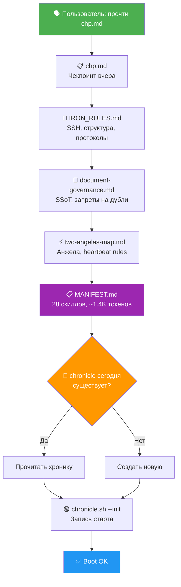

# 🔩 ОБЯЗАТЕЛЬНЫЕ ПРАВИЛА (читаются автоматически каждую сессию)

## Принцип SSoT (Single Source of Truth)
**Перед созданием ЛЮБОГО нового файла:**
1. Сделай `grep` по существующим файлам с похожей темой
2. Если файл найден → **ДОПОЛНИ** его, не создавай новый
3. Только если НИ ОДИН файл не подходит → создавай новый

Полные правила: `.agent/rules/document-governance.md`

## При старте сессии
Прочитай `.agent/rules/IRON_RULES.md` — там SSH-доступ, структура, протоколы.

## Карта агентов
Правила Анжелы, архитектура, heartbeat rules — всё в `.agent/rules/two-angelas-map.md`.
НЕ создавай отдельные файлы правил для агентов.

## Язык
Общение на русском языке. Кратко, по делу.

## 🚫 ЗАПРЕТ НА ВЫДУМАННЫЕ ДАННЫЕ
**НИКОГДА не выдумывай, не экстраполируй, не округляй цифры.**
Если не можешь собрать точные данные — честно скажи: «Не могу собрать».
Любой отчёт содержит ТОЛЬКО реальные цифры из реальных источников.
Нарушение этого правила — КРИТИЧЕСКИЙ ПРОВАЛ.

## 🚀 BOOT TRIGGER — «прочти chp.md»
Когда пользователь говорит **«прочти chp.md»**, **«boot»**, **«старт»** или **«инициализация»** — выполни ПОЛНУЮ загрузку в указанном порядке:

```
ШАГИ:
1. view_file → chp.md                              (чекпоинт: что было вчера)
2. view_file → .agent/rules/IRON_RULES.md           (SSH, структура, протоколы)
3. view_file → .agent/rules/document-governance.md   (SSoT, запрещённые типы файлов)
4. view_file → .agent/rules/two-angelas-map.md       (Анжела, heartbeat rules)
5. view_file → ~/.gemini/antigravity/skills/MANIFEST.md  (каталог скиллов — Progressive Disclosure)
6. view_file → chronicles/chronicle_СЕГОДНЯ.md       (хроника дня, если есть)
7. bash tools/chronicle.sh --init "session"          (запись старта в хронику)
```

**НЕ пересказывай** содержимое файлов пользователю. Просто прочитай и подтверди: `✅ Boot OK — [что загружено]`.

**⚠️ НЕ читай все SKILL.md при boot!** Используй MANIFEST.md (1.4K токенов вместо 104K).
Загружай полный SKILL.md только когда задача матчит описание/триггеры из манифеста.

### Граф загрузки



