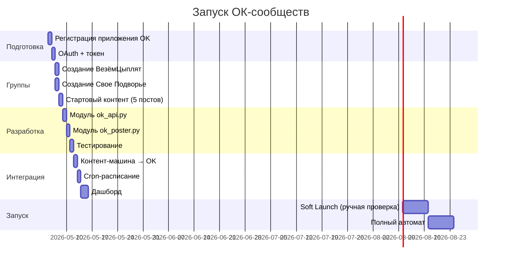

# 📋 План: Запуск сообществ в Одноклассниках

> **Аналог ВК:** ВезёмЦыплят (бизнес) + Свое Подворье (инфо)  
> **Цель:** автопостинг текст+картинка, привязка к контент-машине и дашборду

---

## Фаза 0: Подготовка (1 день)

### 0.1 Регистрация приложения OK
- [ ] Перейти на [apiok.ru/dev/app](https://apiok.ru/dev/app/)
- [ ] Создать приложение типа «Внешнее» (External)
- [ ] Записать: `application_key`, `application_secret_key`, `application_id`
- [ ] Настроить redirect_uri для OAuth
- [ ] Запросить нужные **scope**: `PHOTO_CONTENT`, `GROUP_CONTENT`, `LONG_ACCESS_TOKEN`

### 0.2 Получение access_token
- [ ] OAuth 2.0 авторизация: `https://connect.ok.ru/oauth/authorize`
- [ ] Параметры: `client_id`, `scope`, `redirect_uri`, `response_type=code`
- [ ] Обмен code → access_token через `https://api.ok.ru/oauth/token.do`
- [ ] Сохранить токен в `.env` (или Supabase/Vault)
- [ ] ⚠️ User ДОЛЖЕН быть ADMIN обеих групп!

---

## Фаза 1: Создание групп в ОК (1 день)

> ❌ API НЕ позволяет создавать группы — только через UI ok.ru

### 1.1 Группа «ВезёмЦыплят» (бизнес)
- [ ] Создать группу на ok.ru: тип **«Бизнес»**
- [ ] Название: `ВезёмЦыплят — доставка птицы по России`
- [ ] Описание: адаптация текста с ВК (тёплый тон для аудитории 35-60+)
- [ ] Загрузить аватар (логотип)
- [ ] Загрузить обложку (Рембрандт создаёт)
- [ ] Настроить: контакты, адрес, телефон, сайт
- [ ] Включить: сообщения от группы
- [ ] Записать `GID` в `.env` → `OK_GROUP_VEZEMCIP`

### 1.2 Группа «Свое Подворье» (информационная)
- [ ] Создать группу на ok.ru: тип **«Группа по интересам»**
- [ ] Название: `Свое Подворье — всё о домашней птице`
- [ ] Описание: полезная информация о содержании птицы, рецепты, советы
- [ ] Загрузить аватар + обложку
- [ ] Тематика: животные, сельское хозяйство, домашнее хозяйство
- [ ] Записать `GID` в `.env` → `OK_GROUP_PODVORYE`

### 1.3 Стартовый контент (вручную, 3-5 постов)
- [ ] ВезёмЦыплят: товарные посты (бройлеры, индюшата, цыплята-несушки)
- [ ] Свое Подворье: информационные посты (уход, кормление, советы)
- [ ] Цель: группы НЕ должны быть пустыми при запуске автопостинга

---

## Фаза 2: Модуль автопостинга (2-3 дня)

### 2.1 Структура модуля
```
freelance-2026/
  services/
    ok-poster/
      ├── ok_api.py          # Ядро: подпись, вызовы API
      ├── ok_poster.py       # Автопостинг: upload_photo + mediatopic.post
      ├── ok_stats.py        # Сбор статистики
      ├── config.py          # Конфиг из env vars
      ├── requirements.txt   # requests, python-dotenv
      ├── .env.example       # Шаблон
      └── README.md          # Документация
```

### 2.2 Реализация ядра (`ok_api.py`)
- [ ] Функция подписи запроса (MD5-схема)
- [ ] Универсальный `api_call(method, **params) → dict`
- [ ] Обработка ошибок OK API (коды ошибок)
- [ ] Логирование всех вызовов
- [ ] Retry с backoff (3 попытки)

### 2.3 Загрузка фото (`ok_poster.py`)
- [ ] `upload_photo(gid, file_path) → photo_token`
  1. `photosV2.getUploadUrl` с `gid`
  2. POST multipart/form-data → upload_url
  3. Парсинг ответа → token
- [ ] Поддержка JPG/PNG/WebP
- [ ] Валидация файла перед загрузкой

### 2.4 Публикация поста (`ok_poster.py`)
- [ ] `post_to_group(gid, text, photo_path=None) → post_id`
  1. Если есть фото → upload_photo()
  2. Формирование attachment JSON
  3. `mediatopic.post` с gid + attachment
- [ ] Логирование: post_id, timestamp, group, text_preview

### 2.5 Тестирование
- [ ] Тест: подпись запроса (unit test)
- [ ] Тест: загрузка фото в тестовую группу
- [ ] Тест: пост текст+фото
- [ ] Тест: получение статистики поста

---

## Фаза 3: Интеграция с контент-машиной (2 дня)

### 3.1 Pipeline: Шекспир → OK
```
Шекспир (текст)  ─┐
                   ├→ OK AutoPoster → mediatopic.post
Рембрандт (фото) ─┘
```

- [ ] Адаптер контента ВК → ОК:
  - Тон: тёплый, разговорный (аудитория 35-60+)
  - Эмодзи: активнее, чем в ВК
  - CTA: «Напишите нам!» вместо «Оставьте заявку»
  - Хештеги: #курочки #подворье #домашняяптица

### 3.2 Расписание постинга
| Группа | Частота | Время | Тип контента |
|--------|---------|-------|-------------|
| ВезёмЦыплят | 1 пост/день | 10:00, чередовать 19:00 | Товарный: фото + цена + CTA |
| Свое Подворье | 1 пост/день | 8:00, чередовать 12:00 | Информационный: советы, рецепты |

### 3.3 Cron-задачи
- [ ] Cron: утренний пост (ВезёмЦыплят) — 10:00
- [ ] Cron: утренний пост (Свое Подворье) — 8:00
- [ ] PM2 или системный cron на VPS

---

## Фаза 4: Дашборд (1-2 дня)

### 4.1 Метрики для мониторинга
| Метрика | API метод | Частота |
|---------|-----------|---------|
| Участники группы | `group.getCounters` | Ежедневно |
| Статистика поста | `group.getStatTopic` | Через 24ч после публикации |
| Демография | `group.getStatPeople` | Еженедельно |
| Охват/просмотры | `group.getStatOverview` | Ежедневно |
| Тренды | `group.getStatTrends` | Еженедельно |

### 4.2 Интеграция в SEO-GEO Dashboard
- [ ] Новый раздел: «Соцсети → ОК»
- [ ] Таблица: последние посты (дата, текст, просмотры, лайки)
- [ ] Графики: рост подписчиков, охват
- [ ] Алерты: пост не опубликован (ошибка API)

### 4.3 БД-логирование
```sql
-- Таблица ok_posts (Supabase/Neon)
CREATE TABLE ok_posts (
    id SERIAL PRIMARY KEY,
    group_id VARCHAR(50) NOT NULL,
    group_name VARCHAR(100),
    post_id VARCHAR(50),
    text_preview VARCHAR(200),
    photo_url TEXT,
    published_at TIMESTAMP DEFAULT NOW(),
    views INT DEFAULT 0,
    likes INT DEFAULT 0,
    shares INT DEFAULT 0,
    comments INT DEFAULT 0,
    status VARCHAR(20) DEFAULT 'published'
);
```

---

## Фаза 5: Запуск и масштабирование (ongoing)

### 5.1 Soft Launch
- [ ] Неделя 1: ручная проверка каждого поста перед публикацией
- [ ] Неделя 2: полуавтомат (утверждение → публикация)
- [ ] Неделя 3+: полный автомат по расписанию

### 5.2 Аналитика первого месяца
- [ ] Сравнить ER (engagement rate) ОК vs ВК
- [ ] Определить лучшее время публикации
- [ ] A/B тест: формат постов (длинный текст vs короткий + CTA)
- [ ] Скорректировать контент-стратегию

### 5.3 Будущие фичи (после MVP)
- [ ] Кросс-постинг ВК ↔ ОК (с адаптацией тона)
- [ ] OK Bot API для ответов на сообщения группы
- [ ] Автоответы на комментарии (через `discussions.*`)
- [ ] Видео-посты (через `video.*`)
- [ ] Опросы (`mediatopic.post` с poll attachment)
- [ ] Маркетплейс интеграция (`market.*`)

---

## Хронология



---

> **Итого:** ~2 недели от старта до полного автомата.  
> **Зависимости:** доступ к ok.ru (аккаунт-админ), контент-машина (Шекспир + Рембрандт), дашборд (Next.js).
